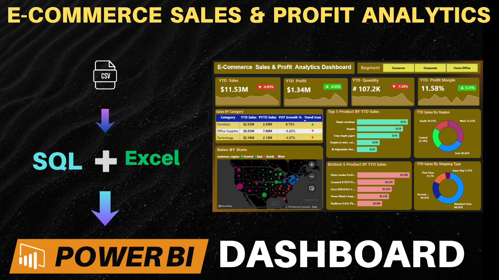
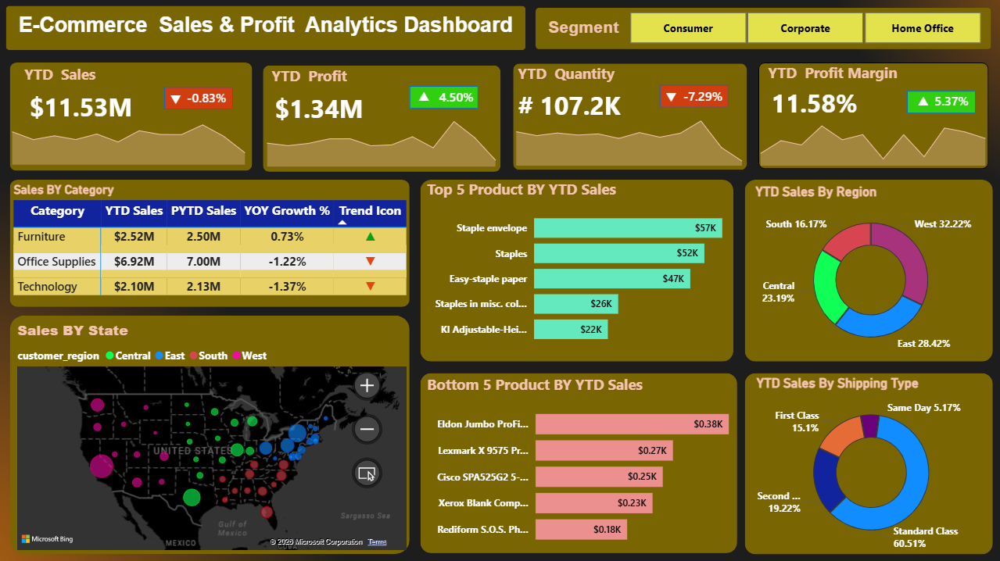

# Ecommerce Sales Power BI Dashboard

##  Project Overview
This project presents an interactive Ecommerce Sales Dashboard built using Power BI to analyze sales performance, profit trends, customer segments, regional sales, and product performance.

The workflow included importing raw ecommerce data into SQL Server for data cleaning and preprocessing before connecting it to Power BI for visualization and business analysis.

---

##  Tools & Technologies Used
- Power BI
- SQL Server
- Microsoft Excel / CSV Dataset
- Data Cleaning
- Data Visualization
- KPI Analysis
- Business Intelligence

---

##  Problem Statement

A US-based Ecommerce Sales Company wanted to create an interactive Sales Dashboard to analyze Year-to-Date (YTD) sales performance and generate business insights for different business scenarios.

### Project Objectives
- Analyze YTD Sales, Profit, Quantity, and Profit Margin
- Compare Year-on-Year (YoY) sales growth
- Analyze regional sales performance
- Identify Top & Bottom Performing Products
- Analyze customer segments and shipping preferences
- Track monthly sales trends and KPI performance

---

##  Dashboard Features
- YTD Sales Analysis
- Profit & Profit Margin Tracking
- Regional Sales Analysis
- Top 5 & Bottom 5 Products
- Customer Segment Insights
- Shipping Mode Analysis
- Monthly Sales Trends
- Interactive Filters & Slicers

---

## 📊 Dashboard Preview

### Main Dashboard

---

##  Key Business Insights
-  The business generated over $11.53 M in YTD Sales with an overall 11.58% Profit Margin, indicating stable profitability with scope for margin improvement. 
- If we compare current year sales to previous year or YOY Growth percentage , Furniture Category is in Uptrend and doing great . 
- The West region contributed the highest sales, while South region underperformed, highlighting opportunities for region-specific growth strategies.  
- Staple envelope and Staples are top-performing products generated a major share of total revenue, showing strong customer demand. 
- Xerox Blank Computer Paper and Rediform S.O.S. Phone Message Books low-performing products contributed 
   minimal sales and profit, potentially increasing inventory and operational costs.  
- Customers preferred Standard Class and Second Class shipping, indicating demand for cost-effective and reliable delivery options.
---

##  Business Recommendations
- Focus marketing and inventory planning on highperforming regions and products to maximize revenue growth.  
- Improve profitability by prioritizing high-margin products instead of only high-sales products.  
- Introduce promotions, bundles, or discounts to improve sales of low-performing products.  
- Optimize inventory and supply chain planning based on seasonal demand trends.  
- Strengthen customer retention through targeted offers and loyalty strategies for high-value customer segments.  
- Improve logistics efficiency around the most preferred shipping methods to enhance customer satisfaction and reduce operational costs. 
---

##  Project Structure
- Data
- PowerBi
- Reports
- Images

---
##  Project Outcome
This dashboard helps businesses monitor sales performance, identify profitable opportunities, optimize operations, and support data-driven decision-making using interactive visual analytics.

---

##  Author
Papai Chakraborty
